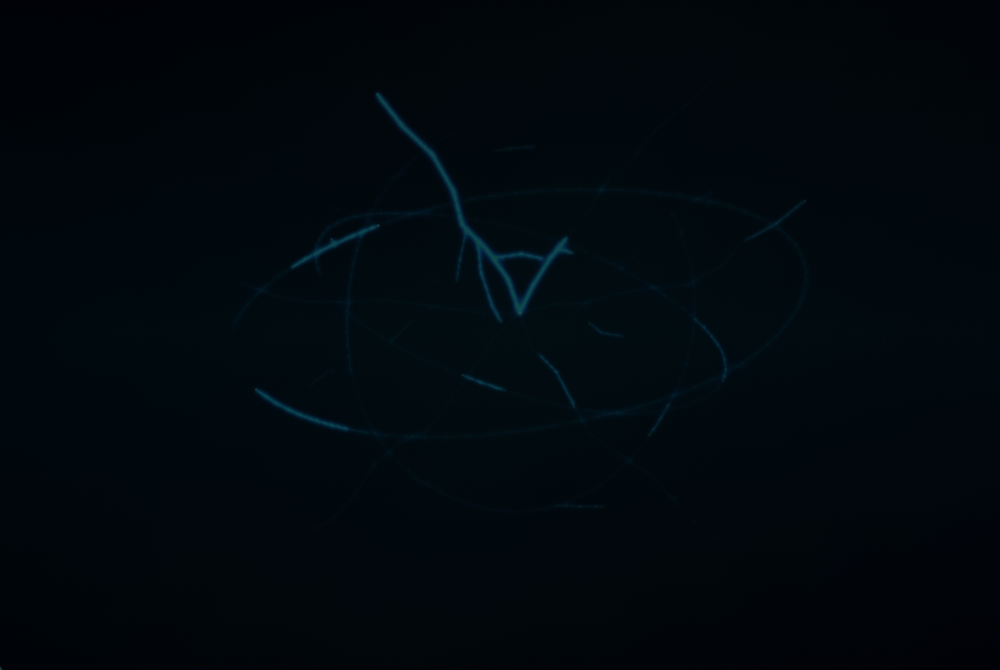
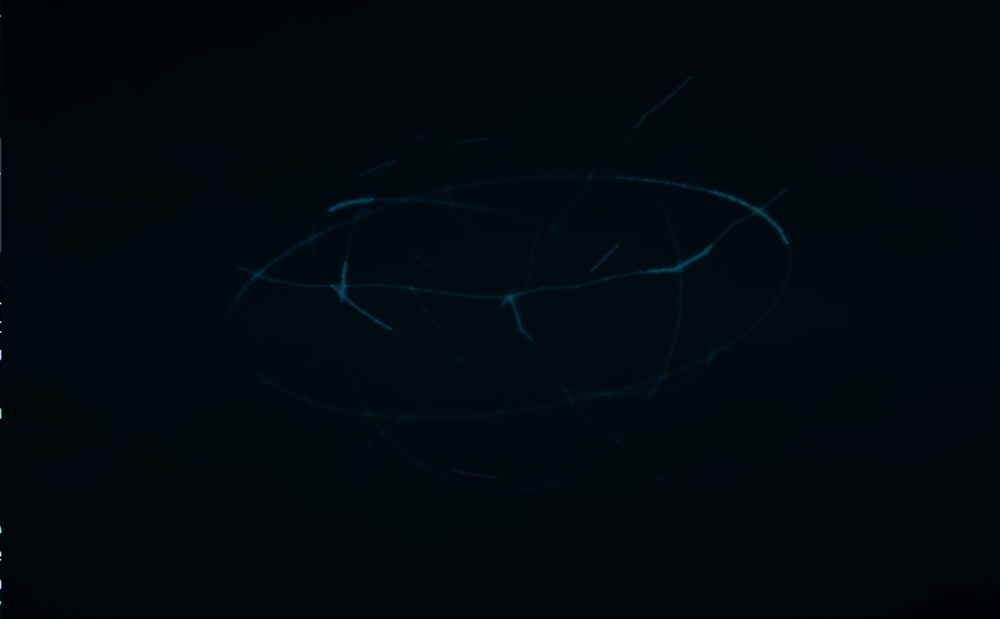

# Electric Control Room

Animated electric control-room theme for WezTerm.

<p align="center">
  
  <br>
  
  <br>
  
</p>

This applies a dark cyan/black terminal treatment, electric cursor and selection accents, transparent window coloring, and a layered APNG background sweep. When `pause_when_idle` is enabled, unfocused shell windows switch to a quieter dormant background after a few unchanged status ticks.

## Install

Requires WezTerm `20230320-124340-559cb7b0` or newer.

```lua
local wezterm = require("wezterm")
local electric = wezterm.plugin.require("https://github.com/Tomauskasz/electric-control-room.wez")

local config = wezterm.config_builder()

electric.apply_to_config(config)

return config
```

WezTerm does not auto-update cloned plugins. Run this from the debug overlay when you want the latest version:

```lua
wezterm.plugin.update_all()
```

## Options

```lua
electric.apply_to_config(config, {
  color_scheme = "Catppuccin Mocha",
  pause_when_idle = true,
  sweep_opacity = 0.24,
  dormant_opacity = 0.14,
})
```

Set `set_color_scheme = false` or `set_colors = false` if you only want the animated background layers.

The idle detector is local-only. It compares the foreground process name and recent visible pane text so the animation stays active while commands are visibly changing.

## Package

- `plugin/init.lua` contains the reusable WezTerm module.
- `assets/control-room-sweep.png` is the animated APNG sweep.
- `assets/control-room-dormant.png` is the quiet background state.

## License

MIT.
